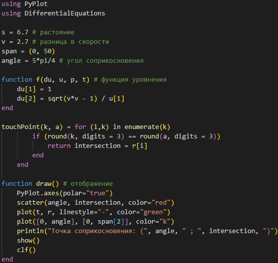
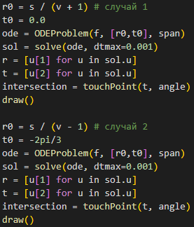
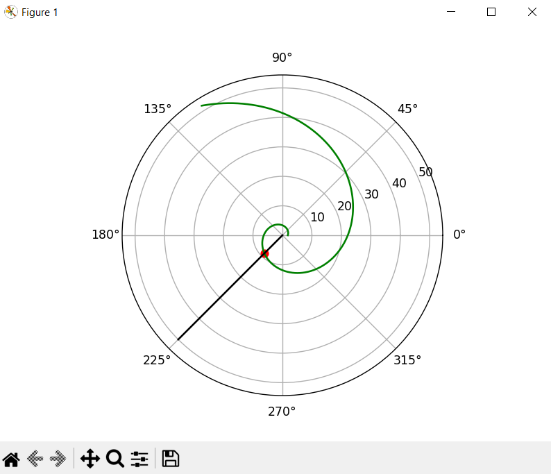
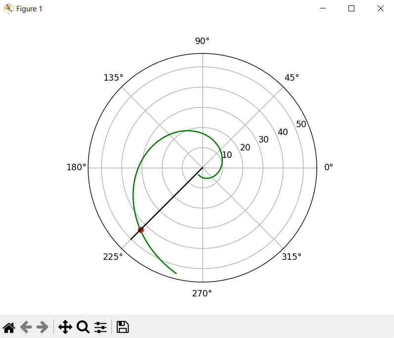
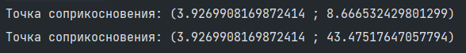

---
## Front matter
lang: ru-RU
title: Лабораторная работа № 2
author:
  - Сулицкий Богдан Романович
group:
  - НФИбд-02-20, 1032201388
date: 2023, Москва

## i18n babel
babel-lang: russian
babel-otherlangs: english

## Formatting pdf
toc: false
toc-title: Содержание
slide_level: 2
aspectratio: 169
section-titles: true
theme: metropolis
header-includes:
 - \metroset{progressbar=frametitle,sectionpage=progressbar,numbering=fraction}
 - '\makeatletter'
 - '\beamer@ignorenonframefalse'
 - '\makeatother'
---

## Цели работы

Целью данной работы является построение математической модели задчи о погоне.

## Задания

1. Записать уравнение, описывающее движение катера, с начальными условиями для двух случаев (в зависимости от расположения катера относительно лодки в начальный момент времени).
2. Построить траекторию движения катера и лодки для двух случаев.
3. Найти точку пересечения траектории катера и лодки.

## Ход работы

Код на Julia - функции ОДУ и визуализации(@fig:001)

{#fig:001 height=60%}

## Ход работы

Код на Julia - решение ОДУ и вызов функции визуализации(@fig:002)

{#fig:002 height=75%}

## Ход работы

Результаты(@fig:003-005)

{#fig:003 height=70%}

## Ход работы

{#fig:004 height=70%}

## Ход работы

{#fig:005}

## Результат

В результате проделанной работы был написан код на Julia, и были построены математические модели траекторий движения катера и лодки для двух случаев.