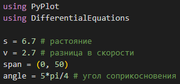
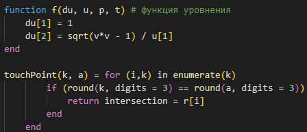
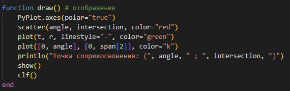
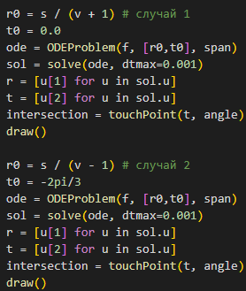
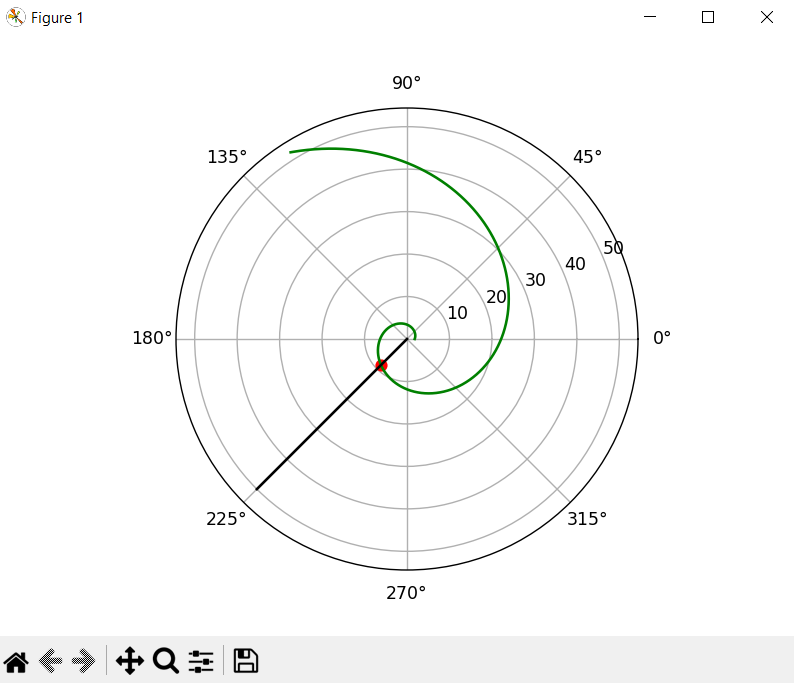
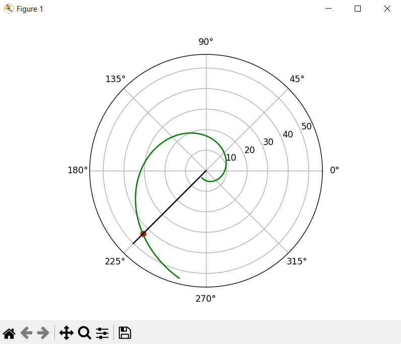
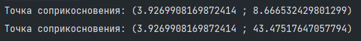

---
## Front matter
title: "Лабораторная работа № 2"
subtitle: "Задача о погоне (Вариант 9)"
author: "Сулицкий Богдан Романович НФИбд-02-20"

## Generic otions
lang: ru-RU
toc-title: "Содержание"

## Bibliography
bibliography: bib/cite.bib
csl: pandoc/csl/gost-r-7-0-5-2008-numeric.csl

## Pdf output format
toc: true # Содержание
toc-depth: 2
lof: true # Список рисунков
lot: true # Список таблиц
fontsize: 12pt
linestretch: 1.5
papersize: a4
documentclass: scrreprt
## I18n polyglossia
polyglossia-lang:
  name: russian
  options:
	- spelling=modern
	- babelshorthands=true
polyglossia-otherlangs:
  name: english
## I18n babel
babel-lang: russian
babel-otherlangs: english
## Fonts
mainfont: PT Serif
romanfont: PT Serif
sansfont: PT Sans
monofont: PT Mono
mainfontoptions: Ligatures=TeX
romanfontoptions: Ligatures=TeX
sansfontoptions: Ligatures=TeX,Scale=MatchLowercase
monofontoptions: Scale=MatchLowercase,Scale=0.9
## Biblatex
biblatex: true
biblio-style: "gost-numeric"
biblatexoptions:
  - parentracker=true
  - backend=biber
  - hyperref=auto
  - language=auto
  - autolang=other*
  - citestyle=gost-numeric
## Pandoc-crossref LaTeX customization
figureTitle: "Рис."
tableTitle: "Таблица"
listingTitle: "Листинг"
lofTitle: "Список иллюстраций"
lotTitle: "Список таблиц"
lolTitle: "Листинги"
## Misc options
indent: true
header-includes:
  - \usepackage{indentfirst}
  - \usepackage{float} # keep figures where there are in the text
  - \floatplacement{figure}{H} # keep figures where there are in the text
---

# Цели работы

Целью данной работы является построение математической модели задчи о погоне.

# Задания [@lab-task:mathmod]

1. Записать уравнение, описывающее движение катера, с начальными условиями для двух случаев (в зависимости от расположения катера относительно лодки в начальный момент времени).
2. Построить траекторию движения катера и лодки для двух случаев.
3. Найти точку пересечения траектории катера и лодки.

# Теоретическое введение [@lab-example:mathmod]

Julia -  высокоуровневый высокопроизводительный свободный язык программирования с динамической типизацией, созданный для математических вычислений.[@diff-eq-doc:julia]

Кривая погони — кривая, представляющая собой решение задачи о «погоне», которая ставится следующим образом. Пусть точка равномерно движется по некоторой заданной кривой. Требуется найти траекторию равномерного движения точки такую, что касательная, проведённая к траектории в любой момент движения, проходила бы через соответствующее этому моменту положение точки.

На море в тумане катер береговой охраны преследует лодку браконьеров. Через определенный промежуток времени туман рассеивается, и лодка обнаруживается на расстоянии 6,7 км от катера. Затем лодка снова скрывается в тумане и уходит прямолинейно в неизвестном направлении. Известно, что скорость катера в 2,7 раза больше скорости браконьерской лодки.

# Выполнение лабораторной работы

## Код на Julia[@diff-eq-doc:julia]

Подключаем нужные библиотеки и создаем переменные расстояния, разницы скорости и угла соприкосновения.[@fig:001]

{#fig:001}

С помощью Differential Equations[@diff-eq-doc:julia] создадим функцию уравнения и опишем метод нахождения точки пересечения.(@fig:002)

{#fig:002}

Создадим функцию отображения математических моделей с помощью Pyplot.(@fig:003)

{#fig:003}

Решим ОДУ и вызовем функцию Pyplot.(@fig:004)

{#fig:004}

Результаты(@fig:005-@fig:007)

{#fig:005}

{#fig:006}

{#fig:007}

# Вывод

В результате проделанной работы был написан код на Julia, и были построены математические модели траекторий движения катера и лодки для двух случаев.

# Список литературы

