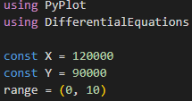
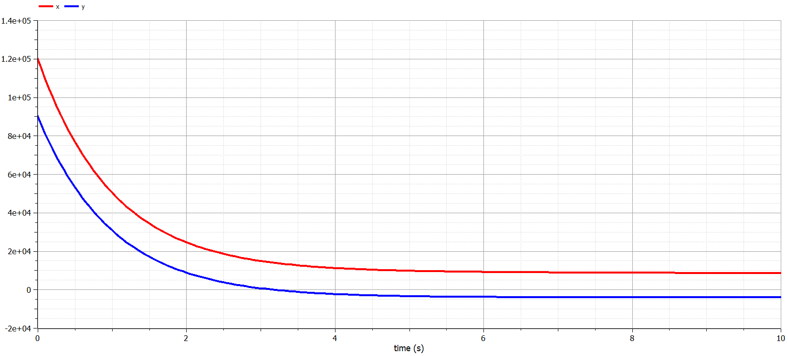

---
## Front matter
title: "Лабораторная работа № 3"
subtitle: "Модель боевых действий (Вариант 9)"
author: "Сулицкий Богдан Романович НФИбд-02-20"

## Generic otions
lang: ru-RU
toc-title: "Содержание"

## Bibliography
bibliography: bib/cite.bib
csl: pandoc/csl/gost-r-7-0-5-2008-numeric.csl

## Pdf output format
toc: true # Table of contents
toc-depth: 2
lof: true # List of figures
lot: false
fontsize: 12pt
linestretch: 1.5
papersize: a4
documentclass: scrreprt
## I18n polyglossia
polyglossia-lang:
  name: russian
  options:
	- spelling=modern
	- babelshorthands=true
polyglossia-otherlangs:
  name: english
## I18n babel
babel-lang: russian
babel-otherlangs: english
## Fonts
mainfont: PT Serif
romanfont: PT Serif
sansfont: PT Sans
monofont: PT Mono
mainfontoptions: Ligatures=TeX
romanfontoptions: Ligatures=TeX
sansfontoptions: Ligatures=TeX,Scale=MatchLowercase
monofontoptions: Scale=MatchLowercase,Scale=0.9
## Biblatex
biblatex: true
biblio-style: "gost-numeric"
biblatexoptions:
  - parentracker=true
  - backend=biber
  - hyperref=auto
  - language=auto
  - autolang=other*
  - citestyle=gost-numeric
## Pandoc-crossref LaTeX customization
figureTitle: "Рис."
tableTitle: "Таблица"
listingTitle: "Листинг"
lofTitle: "Список иллюстраций"
lotTitle: "Список таблиц"
lolTitle: "Листинги"
## Misc options
indent: true
header-includes:
  - \usepackage{indentfirst}
  - \usepackage{float} # keep figures where there are in the text
  - \floatplacement{figure}{H} # keep figures where there are in the text
---

# Цели работы

Целью данной работы является построение математической модели военных действий.

# Задание[@lab-task:mathmod]

1. Построить модель боевых действий между регулярный войсками;
2. Построить модель ведения боевых действий с участием регулярных войск и партизанских отрядов.

# Теоретическое введение [@lab-example:mathmod]

Между страной $Х$ и страной $Y$ идет война. Численность состава войск исчисляется от начала войны, и являются временными функциями $x(t)$ и $y(t)$. В начальный момент времени страна $Х$ имеет армию численностью $120000$ человек, а в распоряжении страны $У$ армия численностью в $90000$ человек. Для упрощения модели считаем, что коэффициенты $a$, $b$, $c$, $h$ постоянны. Также считаем $P(t)$ и $Q(t)$ непрерывные функции.
Построим графики изменения численности войск армии $Х$ и армии $У$ для следующих случаев:

1. Модель боевых действий между регулярными войсками:
    
    $\frac{dx}{dt}=-0,35x(t)-0,75y(t)+sin(t)+1$

    $\frac{dx}{dt}=-0,29x(t)-0,65y(t)+cos(t)+1$

2. Модель ведение боевых действий с участием регулярных войск и партизанских отрядов:

    $\frac{dx}{dt}=-0,24x(t)-0,61y(t)+sin(2t)$

    $\frac{dx}{dt}=-0,3x(t)-0,71y(t)+cos(3t)$

# Выполнение лабораторной работы

## Код на Julia

Подключаем нужные библиотеки и создаем переменные.(@fig:001)

{#fig:001}

С помощью Differential Equations[@diff-eq-doc:julia] создадим функции уравнения и визуализации.(@fig:002-@fig:003)

{#fig:002}

{#fig:003}

Решаем ОДУ для обоих случаев и создаем математические модели.(@fig:004)

{#fig:004}

Результаты:(@fig:005-@fig:008)

{#fig:005}

.png){#fig:006}

{#fig:007}

.png){#fig:008}

## Код на OpenModelica

Реализуем код на OpenModelica, указав начальные значения переменных. Далее запишем ОДУ, а также укажем интервалы.(@fig:009-@fig:010)

{#fig:009}

{#fig:010}

Результаты:(@fig:011-@fig:014)

{#fig:011}

.png){#fig:012}

{#fig:013}

.png){#fig:014}

# Вывод
В ходе проделанной работы были изучены модели Ланчестера для моделирования ведения боевых действий, а также были построены математические модели боевых действий между регулярный войсками и ведения боевых действий с участием регулярных войск и партизанских отрядов на языке программирования Julia и OpenModelica

# Список литератры
