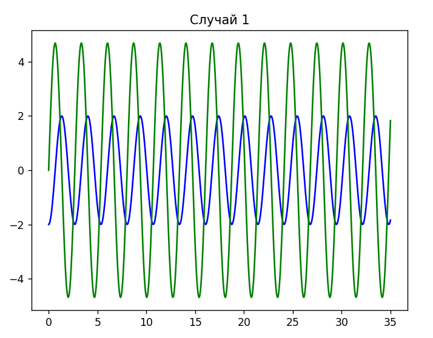

---
## Front matter
title: "Лабораторная работа № 4"
subtitle: "Модель гармонический колебаний (Вариант 9)"
author: "Сулицкий Богдан Романович"

## Generic otions
lang: ru-RU
toc-title: "Содержание"

## Bibliography
bibliography: bib/cite.bib
csl: pandoc/csl/gost-r-7-0-5-2008-numeric.csl

## Pdf output format
toc: true # Table of contents
toc-depth: 2
lof: true # List of figures
lot: false
fontsize: 12pt
linestretch: 1.5
papersize: a4
documentclass: scrreprt
## I18n polyglossia
polyglossia-lang:
  name: russian
  options:
	- spelling=modern
	- babelshorthands=true
polyglossia-otherlangs:
  name: english
## I18n babel
babel-lang: russian
babel-otherlangs: english
## Fonts
mainfont: PT Serif
romanfont: PT Serif
sansfont: PT Sans
monofont: PT Mono
mainfontoptions: Ligatures=TeX
romanfontoptions: Ligatures=TeX
sansfontoptions: Ligatures=TeX,Scale=MatchLowercase
monofontoptions: Scale=MatchLowercase,Scale=0.9
## Biblatex
biblatex: true
biblio-style: "gost-numeric"
biblatexoptions:
  - parentracker=true
  - backend=biber
  - hyperref=auto
  - language=auto
  - autolang=other*
  - citestyle=gost-numeric
## Pandoc-crossref LaTeX customization
figureTitle: "Рис."
tableTitle: "Таблица"
listingTitle: "Листинг"
lofTitle: "Список иллюстраций"
lotTitle: "Список таблиц"
lolTitle: "Листинги"
## Misc options
indent: true
header-includes:
  - \usepackage{indentfirst}
  - \usepackage{float} # keep figures where there are in the text
  - \floatplacement{figure}{H} # keep figures where there are in the text
---

# Цели работы

Целью данной лабораторной работы является построение математической модели гармонический колебаний.

# Задание [@lab-example:mathmod]

Построить фазовый портрет гармонического осциллятора и решение уравнения гармонического осциллятора для следующих случаев:

1. Колебания гармонического осциллятора без затуханий и без действий внешней cил:
$\ddot{x} + 5.5x = 0$
2. Колебания гармонического осциллятора c затуханием и без действий внешней силы:
$\ddot{x} + 20\dot{x} + 2x = 0$
3. Колебания гармонического осциллятора c затуханием и под действием внешней силы:
$\ddot{x} + \dot{x} + 9x = 2sin(t)$

# Теоретическое введение[@lab-task:mathmod]

Движение грузика на пружинке, маятника, заряда в электрическом контуре, а также эволюция во времени многих систем в физике, химии, биологии и других науках при определенных предположениях можно описать одним и тем же дифференциальным уравнением, которое в теории колебаний выступает в качестве основной модели. Эта модель называется линейным гармоническим осциллятором. Уравнение свободных колебаний гармонического осциллятора имеет следующий вид:

$\ddot{x} + 2\gamma\dot{x} + \omega_{0}^2x = 0$

где x – переменная, описывающая состояние системы (смещение грузика, заряд конденсатора и т.д.), $\gamma$ – параметр, характеризующий потери энергии (трение в механической системе, сопротивление в контуре),  $\omega_{0}$ – собственная частота колебаний, $t$ – время.

# Выполнение лабораторной работы

## Код на Julia

Подключаем нужные библиотеки и создаем переменные.(@fig:001)

{#fig:001}

С помощью Differential Equations[@diff-eq-doc:julia] создадим функции уравнения и визуализации.(@fig:002-@fig:003)

{#fig:002}

{#fig:003}

Решаем ОДУ для обоих случаев и создаем математические модели.(@fig:004)

{#fig:004}

Результаты:(@fig:005-@fig:010)

{#fig:005}

.png){#fig:006}

{#fig:007}

.png){#fig:008}

{#fig:009}

.png){#fig:010}

## Код на OpenModelica

Реализуем код на OpenModelica, указав начальные значения переменных. Далее запишем ОДУ, а также укажем интервалы.(@fig:010-@fig:012)

{#fig:010}

{#fig:011}

{#fig:012}

Результаты:(@fig:013-@fig:018)

{#fig:013}

.png){#fig:014}

{#fig:015}

.png){#fig:016}

{#fig:017}

.png){#fig:018}

# Вывод
В результате проделанной работы были построены математические модели 3 случаев движения гармонического осциллятора.

# Список Литературы
