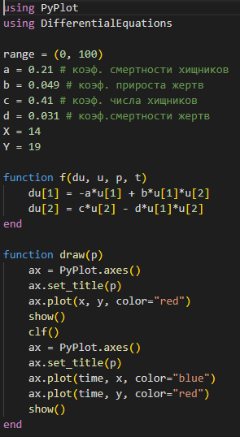
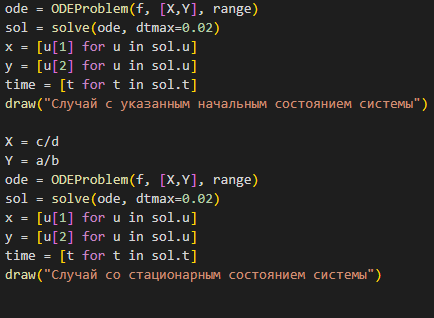
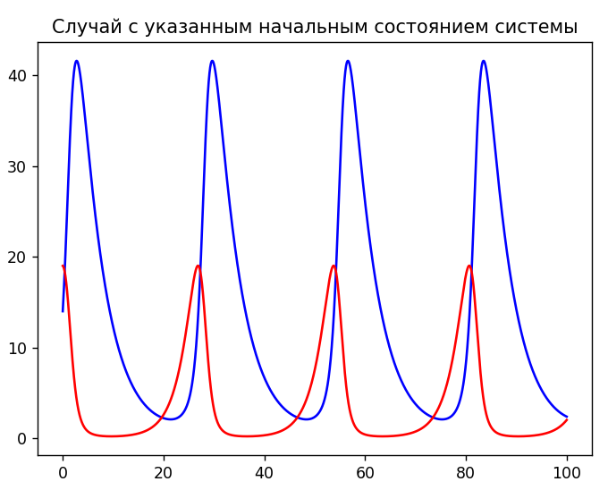
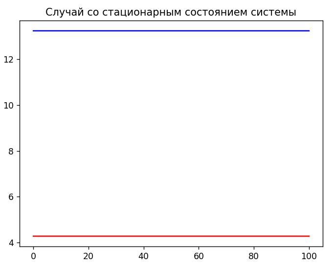
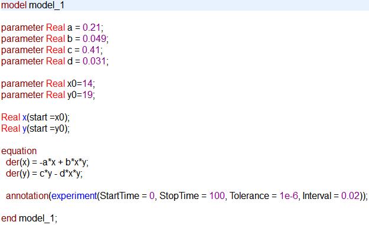
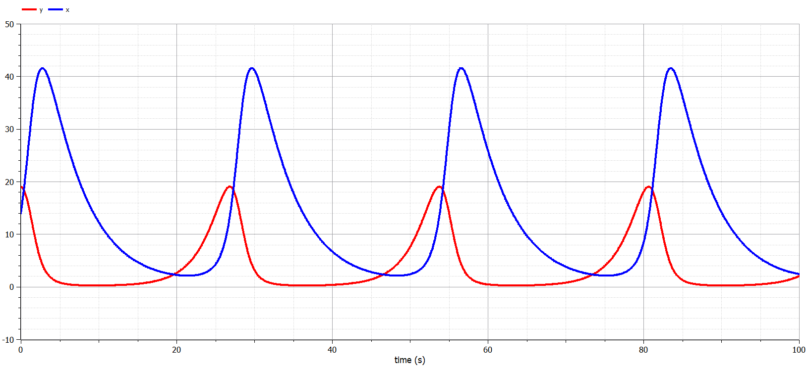
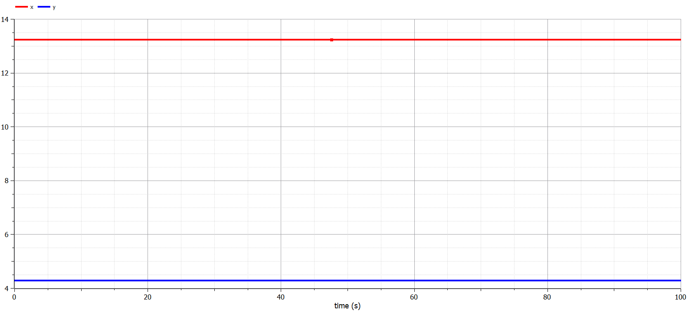

---
## Front matter
lang: ru-RU
title: Лабораторная работа № 5
author:
  - Сулицкий Богдан Романович
group:
  - НФИбд-02-20, 1032201388
date: 2023, Москва

## i18n babel
babel-lang: russian
babel-otherlangs: english

## Formatting pdf
toc: false
toc-title: Содержание
slide_level: 2
aspectratio: 169
section-titles: true
theme: metropolis
header-includes:
 - \metroset{progressbar=frametitle,sectionpage=progressbar,numbering=fraction}
 - '\makeatletter'
 - '\beamer@ignorenonframefalse'
 - '\makeatother'
---

## Цели

Целью данной работы является построение модели хищник-жертва.

## Задачи

1. Построить график зависимости численности хищников от численности жертв

2. Построить график зависимости численности хищников и численности жертв от времени

3. Найти стационарное состояние системы

## Ход работы

Код на Julia - функции ОДУ и визуализации(@fig:001)

{#fig:001 height=60%}

## Ход работы

Код на Julia - решение ОДУ и вызов функции визуализации(@fig:002)

{#fig:002 height=75%}

## Ход работы

Результаты:(@fig:003-@fig:006)

{#fig:003 height=75%}

## Ход работы

.png){#fig:004 height=75%}

## Ход работы

{#fig:005 height=75%}

## Ход работы

.png){#fig:006 height=75%}

## Ход работы

Код OpenModelica.(@fig:007-@fig:008)

{#fig:007 height=75%}

## Ход работы

{#fig:008 height=75%}

## Ход работы

Результаты:(@fig:009-@fig:012)

{#fig:009 height=75%}

## Ход работы

.png){#fig:010 height=75%}

## Ход работы

{#fig:011 height=75%}

## Ход работы

.png){#fig:012 height=75%}

## Результаты

В результате проделанной работы были построены математические модели 3 случаев движения гармонического осциллятора.
