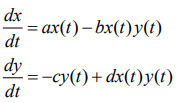

---
## Front matter
title: "Лабораторная работа № 5"
subtitle: "Модель гармонический колебаний (Вариант 9)"
author: "Сулицкий Богдан Романович"

## Generic otions
lang: ru-RU
toc-title: "Содержание"

## Bibliography
bibliography: bib/cite.bib
csl: pandoc/csl/gost-r-7-0-5-2008-numeric.csl

## Pdf output format
toc: true # Table of contents
toc-depth: 2
lof: true # List of figures
lot: false
fontsize: 12pt
linestretch: 1.5
papersize: a4
documentclass: scrreprt
## I18n polyglossia
polyglossia-lang:
  name: russian
  options:
	- spelling=modern
	- babelshorthands=true
polyglossia-otherlangs:
  name: english
## I18n babel
babel-lang: russian
babel-otherlangs: english
## Fonts
mainfont: PT Serif
romanfont: PT Serif
sansfont: PT Sans
monofont: PT Mono
mainfontoptions: Ligatures=TeX
romanfontoptions: Ligatures=TeX
sansfontoptions: Ligatures=TeX,Scale=MatchLowercase
monofontoptions: Scale=MatchLowercase,Scale=0.9
## Biblatex
biblatex: true
biblio-style: "gost-numeric"
biblatexoptions:
  - parentracker=true
  - backend=biber
  - hyperref=auto
  - language=auto
  - autolang=other*
  - citestyle=gost-numeric
## Pandoc-crossref LaTeX customization
figureTitle: "Рис."
tableTitle: "Таблица"
listingTitle: "Листинг"
lofTitle: "Список иллюстраций"
lotTitle: "Список таблиц"
lolTitle: "Листинги"
## Misc options
indent: true
header-includes:
  - \usepackage{indentfirst}
  - \usepackage{float} # keep figures where there are in the text
  - \floatplacement{figure}{H} # keep figures where there are in the text
---

# Цели работы

Целью данной лабораторной работы является построение математической модели хищник-жертва.

# Задания
Для модели «хищник-жертва»:

1. Построить график зависимости численности хищников от численности жертв, а также графики изменения численности хищников и численности жертв при следующих начальных условиях: $x_{0} = 9, y_{0} = 29$. 
2. Найти стационарное состояние системы.

# Теоретическое введение:
Простейшая модель взаимодействия двух видов типа «хищник —  жертва» - модель  Лотки-Вольтерры.  Данная  двувидовая  модель  основывается  на следующих предположениях:

1. Численность популяции жертв x и хищников y зависят только от времени (модель  не  учитывает  пространственное  распределение  популяции  на занимаемой территории).

2. В отсутствии взаимодействия численность видов изменяется  по модели  Мальтуса, при этом число жертв увеличивается, а число хищников падает.

3.  Естественная  смертность  жертвы  и  естественная  рождаемость  хищника считаются несущественными. 

4.  Эффект насыщения численности обеих популяций не учитывается.

5.  Скорость  роста  численности  жертв  уменьшается  пропорционально численности хищников (@fig:001).

{#fig:001}

В  этой  модели  x – число  жертв,  y - число  хищников.  Коэффициент a описывает скорость естественного прироста числа жертв в отсутстви хищников, с -  естественное вымирание хищников, лишенных пищи в виде жертв. Вероятность взаимодействия  жертвы  и  хищника  считается пропорциональной  как  количеству жертв, так и числу самих хищников (xy). Каждый акт взаимодействия уменьшает популяцию жертв, но способствует увеличению популяции хищников (члены -bxy  и dxy в правой части уравнения). 

# Выполнение лабораторной работы

## Код на Julia:

Подключаем нужные библиотеки и создаем переменные.(@fig:002)

{#fig:002}

С помощью Differential Equations[@diff-eq-doc:julia] создадим функции уравнения и визуализации.(@fig:003)

{#fig:003}

Решаем ОДУ для обоих случаев и создаем математические модели.(@fig:004)

{#fig:004}

Результаты:(@fig:005-@fig:008)

{#fig:005}

.png){#fig:006}

{#fig:007}

.png){#fig:008}

## Код на OpenModelica

Реализуем код на OpenModelica, указав начальные значения переменных. Далее запишем ОДУ, а также укажем интервалы.(@fig:009-@fig:010)

{#fig:009}

{#fig:010}

Результаты:(@fig:011-@fig:014)

{#fig:011}

.png){#fig:012}

{#fig:013}

.png){#fig:014}

# Вывод

В результате проделанной работы был написан код на Julia и OpenModelica и были построены математические модели: график зависимости численности хищников от численности жертв, а также график зависимости численности хищников и численности жертв от времени в стационарной системе.

# Список литературы