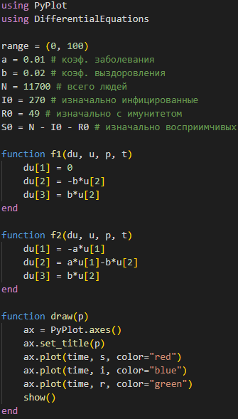
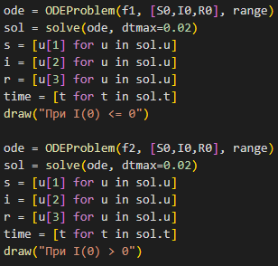
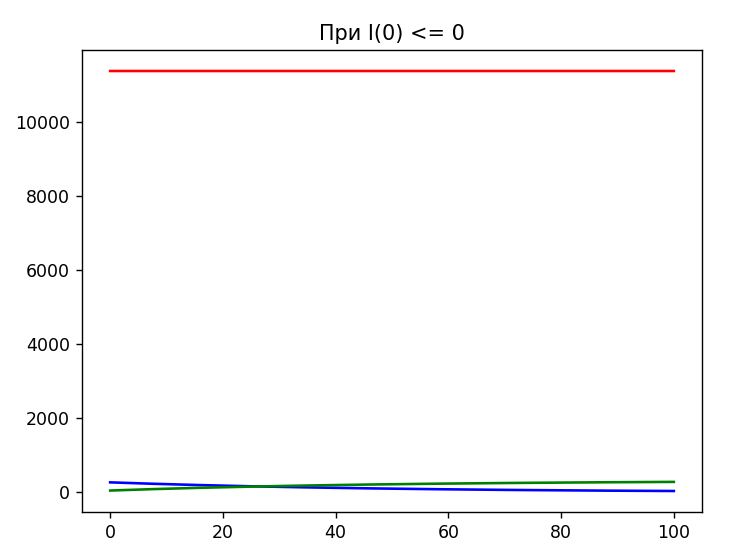
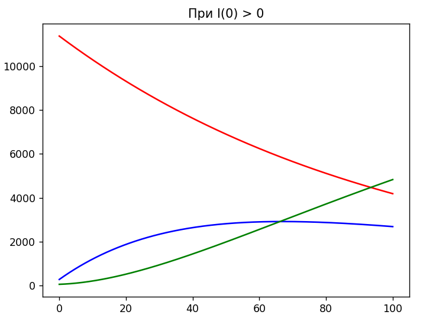
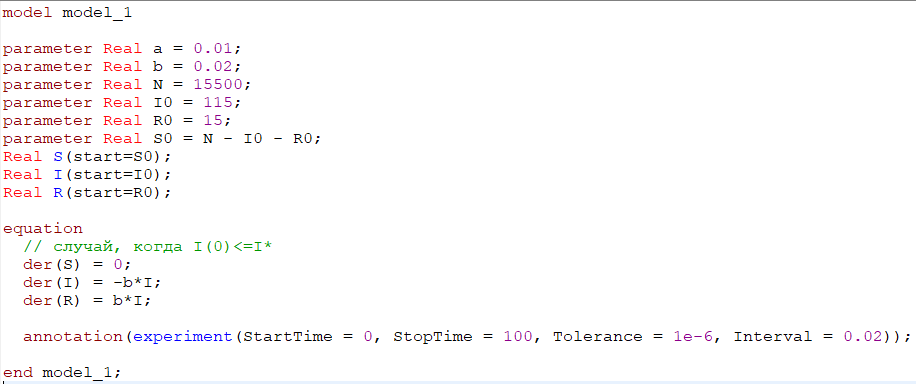
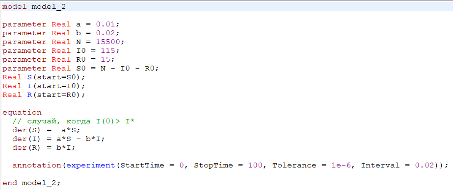
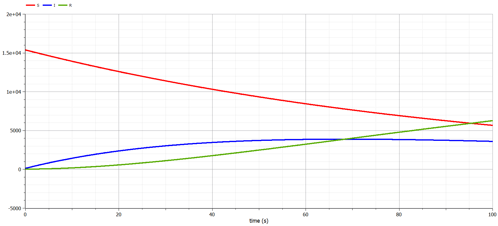

---
## Front matter
lang: ru-RU
title: Лабораторная работа № 6
author:
  - Сулицкий Богдан Романович
group:
  - НФИбд-02-20, 1032201388
date: 2023, Москва

## i18n babel
babel-lang: russian
babel-otherlangs: english

## Formatting pdf
toc: false
toc-title: Содержание
slide_level: 2
aspectratio: 169
section-titles: true
theme: metropolis
header-includes:
 - \metroset{progressbar=frametitle,sectionpage=progressbar,numbering=fraction}
 - '\makeatletter'
 - '\beamer@ignorenonframefalse'
 - '\makeatother'
---

## Цели работы

Целью данной работы является построение математической модели простейшую модель эпидемии $SIR$.
После построить графики изменения численностей трех групп в двух случаях.

## Задания

1.	Изучить модель эпидемии
2.	Построить графики изменения числа особей в каждой из трех групп. Рассмотреть, как будет протекать эпидемия в случае: $I(0)\leq I^*$, $I(0)>I^*$

## Ход работы

Код на Julia - функции ОДУ и визуализации(@fig:001)

{#fig:001 height=60%}

## Ход работы

Код на Julia - решение ОДУ и вызов функции визуализации(@fig:002)

{#fig:002 height=75%}

## Ход работы

Результаты:(@fig:003@fig:004)

{#fig:003 height=60%}

## Ход работы

{#fig:004 height=60%}

## Ход работы

Код на OpenModelica(@fig:005-@fig:006)

{#fig:005 height=75%}

## Ход работы

{#fig:006 height=75%}

## Ход работы

Результаты:(@fig:007-@fig:008)

{#fig:007 height=60%}

## Ход работы

{#fig:008 height=60%}

## Результаты

В ходе выполнения лабораторной работы была изучена простейшая модель эпидемии и построены графики на основе условий задачи и начальных данных, которые были описаны в варианте лабораторной работы.