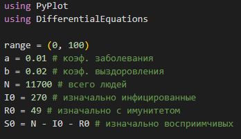
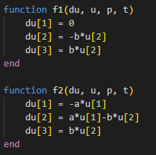
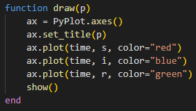
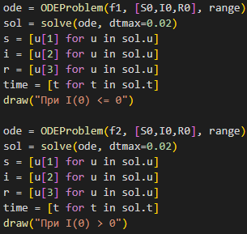
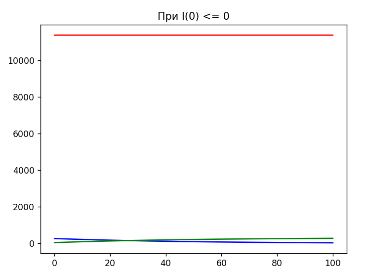
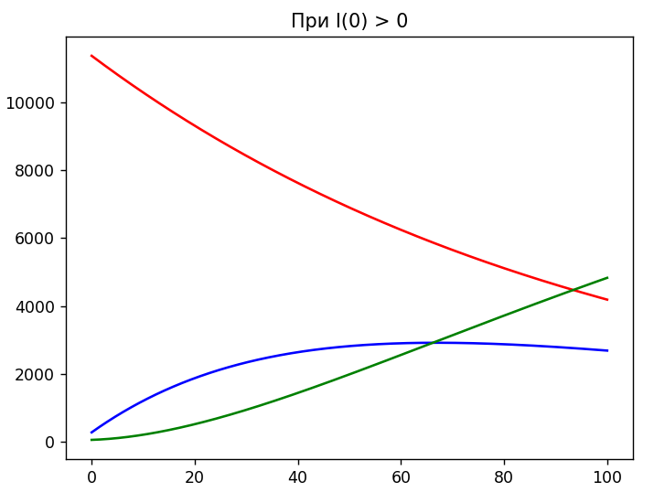
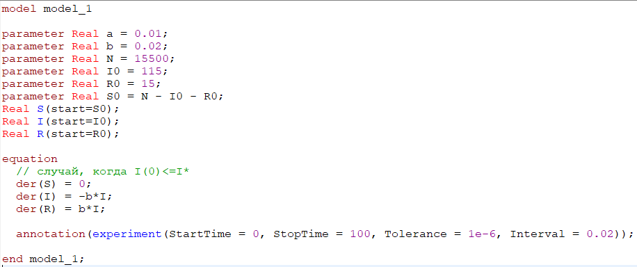
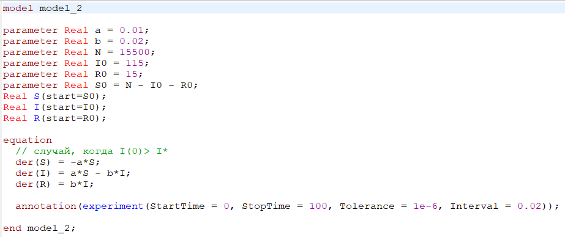
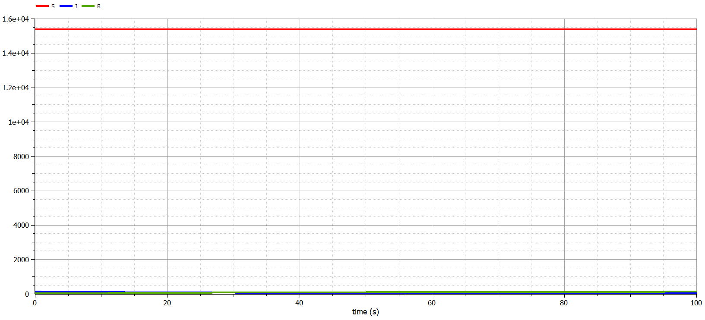
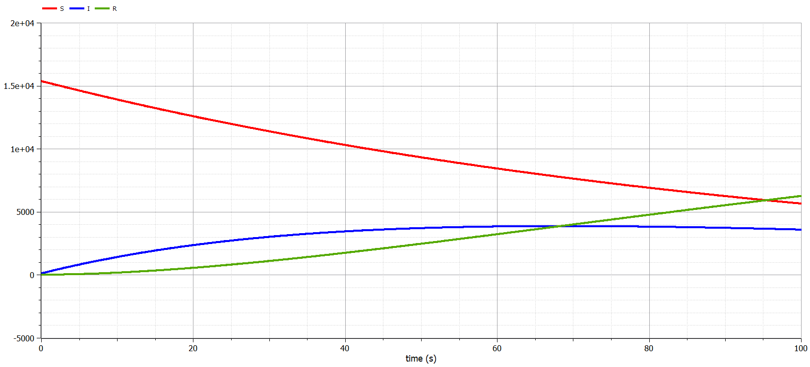

---
## Front matter
title: "Лабораторная работа № 6"
subtitle: "Модель эпидемии SIR (Вариант 9)"
author: "Сулицкий Богдан Романович НФИбд-02-20"

## Generic otions
lang: ru-RU
toc-title: "Содержание"

## Bibliography
bibliography: bib/cite.bib
csl: pandoc/csl/gost-r-7-0-5-2008-numeric.csl

## Pdf output format
toc: true # Table of contents
toc-depth: 2
lof: true # List of figures
lot: false
fontsize: 12pt
linestretch: 1.5
papersize: a4
documentclass: scrreprt
## I18n polyglossia
polyglossia-lang:
  name: russian
  options:
    - spelling=modern
    - babelshorthands=true
polyglossia-otherlangs:
  name: english
## I18n babel
babel-lang: russian
babel-otherlangs: english
## Fonts
mainfont: PT Serif
romanfont: PT Serif
sansfont: PT Sans
monofont: PT Mono
mainfontoptions: Ligatures=TeX
romanfontoptions: Ligatures=TeX
sansfontoptions: Ligatures=TeX,Scale=MatchLowercase
monofontoptions: Scale=MatchLowercase,Scale=0.9
## Biblatex
biblatex: true
biblio-style: "gost-numeric"
biblatexoptions:
  - parentracker=true
  - backend=biber
  - hyperref=auto
  - language=auto
  - autolang=other*
  - citestyle=gost-numeric
## Pandoc-crossref LaTeX customization
figureTitle: "Рис."
tableTitle: "Таблица"
listingTitle: "Листинг"
lofTitle: "Список иллюстраций"
lotTitle: "Список таблиц"
lolTitle: "Листинги"
## Misc options
indent: true
header-includes:
  - \usepackage{indentfirst}
  - \usepackage{float} # keep figures where there are in the text
  - \floatplacement{figure}{H} # keep figures where there are in the text
---
# Цель работы

Целью данной работы является построение математической модели эпидемии $SIR$. Используя условия из варианты, задать в уравнение начальные условия и коэффициенты.
После построить графики изменения численностей трех групп в двух случаях.

# Задание[@lab-task:mathmod]

1.	Изучить модель эпидемии
2.	Построить графики изменения числа особей в каждой из трех групп. 
3.	Рассмотреть, как будет протекать эпидемия в случае: $I(0)\leq I^*$, $I(0)>I^*$

## Теоретические введение[@lab-example:mathmod]:

Рассмотрим простейшую модель эпидемии. Предположим, что некая популяция, состоящая из $N$ особей, (считаем, что популяция изолирована) подразделяется на три группы. Первая группа - это восприимчивые к болезни, но пока здоровые особи, обозначим их через $S(t)$. Вторая группа – это число инфицированных особей, которые также при этом являются распространителями инфекции, обозначим их $I(t)$. А третья группа, обозначающаяся через $R(t)$ – это здоровые особи с иммунитетом к болезни. 
До того, как число заболевших не превышает критического значения $I^*$, считаем, что все больные изолированы и не заражают здоровых. Когда $I(t)> I^*$, тогда инфицирование способны заражать восприимчивых к болезни особей. 

Таким образом, скорость изменения числа $S(t)$ меняется по следующему закону:

$$
\frac{dS}{dt}=
 \begin{cases}
	-\alpha S &\text{,если $I(t) > I^*$}
	\\   
	0 &\text{,если $I(t) \leq I^*$}
 \end{cases}
$$

Поскольку каждая восприимчивая к болезни особь, которая, в конце концов, заболевает, сама становится инфекционной, то скорость изменения числа инфекционных особей представляет разность за единицу времени между заразившимися и теми, кто уже болеет и лечится. Т.е.:

$$
\frac{dI}{dt}=
 \begin{cases}
	\alpha S -\beta I &\text{,если $I(t) > I^*$}
	\\   
	-\beta I &\text{,если $I(t) \leq I^*$}
 \end{cases}
$$

Рассмотрим скорость изменения выздоравливающих особей, которые при этом приобретают иммунитет к болезни:

$$\frac{dR}{dt} = \beta I$$

Постоянные пропорциональности $\alpha, \beta$ - это коэффициенты заболеваемости и выздоровления соответственно. Для того, чтобы решения соответствующих уравнений определялось однозначно, необходимо задать начальные условия. Считаем, что на начало эпидемии в момент времени $t=0$ нет особей с иммунитетом к болезни $R(0)=0$, а число инфицированных и восприимчивых к болезни особей $I(0)$ и $S(0)$ соответственно. Для анализа картины протекания эпидемии необходимо рассмотреть два случая:  $I(0) \leq I^*$ и  $I(0)>I^*$

На одном небольшом острове вспыхнула эпидемия. 
Известно, что из всех проживающих на острове $(N=15500)$ в момент начала эпидемии $(t=0)$ число заболевших людей (являющихся распространителями инфекции) $I(0)=115$.
Число здоровых людей с иммунитетом к болезни $R(0)=15$. 
Таким образом, число людей восприимчивых к болезни, но пока здоровых, в начальный момент времени $S(0)=N-I(0)-R(0)$.
Постройте графики изменения числа особей в каждой из трех групп.
Рассмотрите, как будет протекать эпидемия в случае:
1.	$I(0)\leq I^*$
2.	$I(0)>I^*$

# Выполнение лабораторной работы

## Код на Julia

Подключаем нужные библиотеки и создаем переменные.(@fig:001)

{#fig:001}

С помощью Differential Equations[@diff-eq-doc:julia] создадим функции уравнения и визуализации.(@fig:002-@fig:003)

{#fig:002}

{#fig:003}

Решаем ОДУ для обоих случаев и создаем математические модели.(@fig:004)

{#fig:004}

Результаты:(@fig:005-@fig:006)

{#fig:005}

{#fig:006}

## Код на OpenModelica

Реализуем код на OpenModelica, указав начальные значения переменных. Далее запишем ОДУ, а также укажем интервалы.(@fig:007-@fig:008)

{#fig:007}

{#fig:008}

Результаты:(@fig:009-@fig:010)

{#fig:009}

{#fig:010}

# Выводы

В ходе выполнения лабораторной работы была изучена простейшая модель эпидемии и построены графики на основе условий задачи и начальных данных, которые были описаны в варианте лабораторной работы.

# Список литературы 