---
## Front matter
lang: ru-RU
title: Лабораторная работа № 7
author:
  - Сулицкий Богдан Романович
group:
  - НФИбд-02-20, 1032201388
date: 2023, Москва

## i18n babel
babel-lang: russian
babel-otherlangs: english

## Formatting pdf
toc: false
toc-title: Содержание
slide_level: 2
aspectratio: 169
section-titles: true
theme: metropolis
header-includes:
 - \metroset{progressbar=frametitle,sectionpage=progressbar,numbering=fraction}
 - '\makeatletter'
 - '\beamer@ignorenonframefalse'
 - '\makeatother'
---

## Цели работы

Целью данной работы является построение математической модели эффективности распространения рекламы о салоне красоты. Задать эффективность в трёх случаях.
Построить решение на основе начальных данных. Сделать на основании построений выводы.

## Задания

1.  Изучить модель эфеективности распространения рекламы
2.	Построить графики распространения рекламы в трех заданных случайх
3.	Определить для случая 2 момент времени, в который скорость распространения рекламы будет максимальной
4.	Сделать выводы из трех моделей

## Ход работы

Код на Julia - функции ОДУ и визуализации(@fig:001)

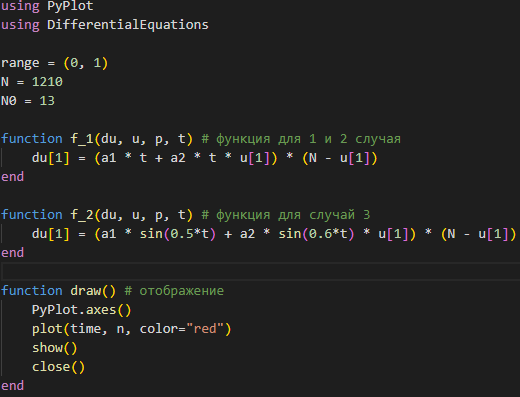{#fig:001 height=60%}

## Ход работы

Код на Julia - решение ОДУ и вызов функции визуализации(@fig:002)

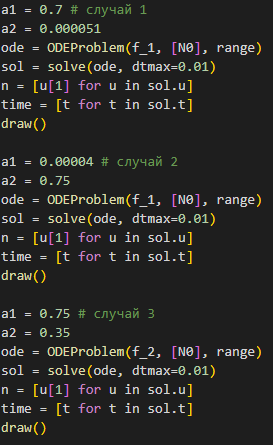{#fig:002 height=75%}

## Ход работы

Результаты:(@fig:003-@fig:005)

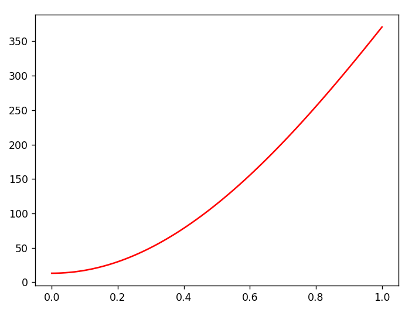{#fig:003 height=60%}

## Ход работы

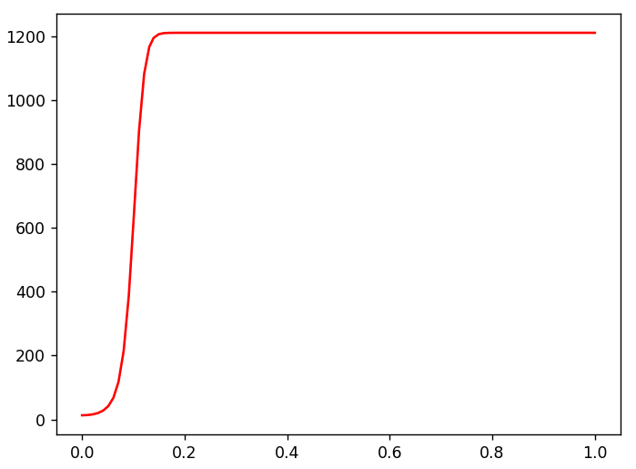{#fig:004 height=60%}

## Ход работы

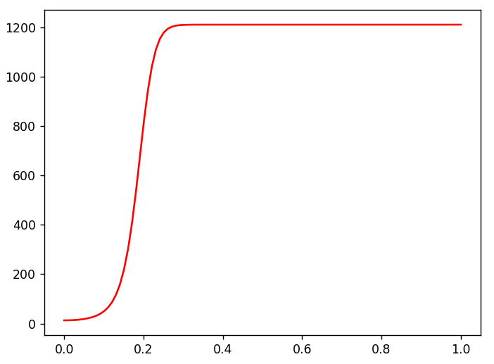{#fig:005 height=60%}

## Ход работы

Код на OpenModelica(@fig:006-@fig:008)

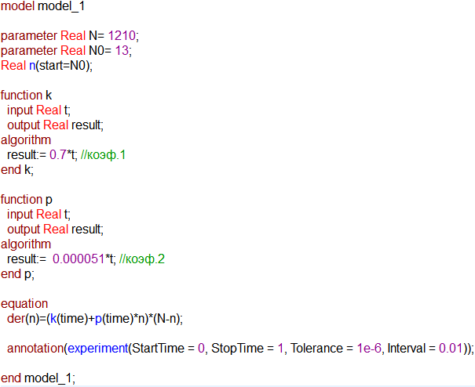{#fig:006 height=75%}

## Ход работы

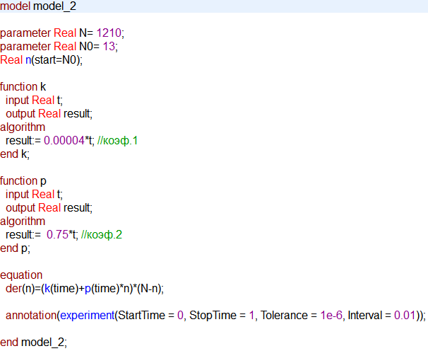{#fig:007 height=75%}

## Ход работы

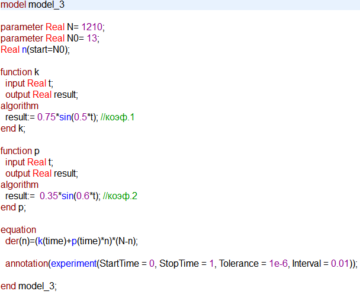{#fig:008 height=75%}

## Ход работы

Результаты:(@fig:009-@fig:011)

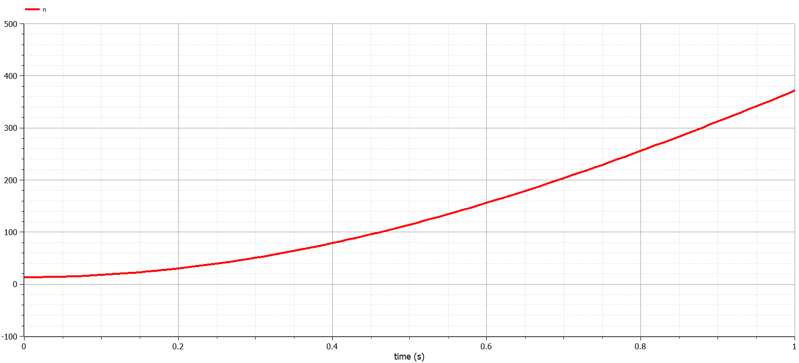{#fig:009 height=60%}

## Ход работы

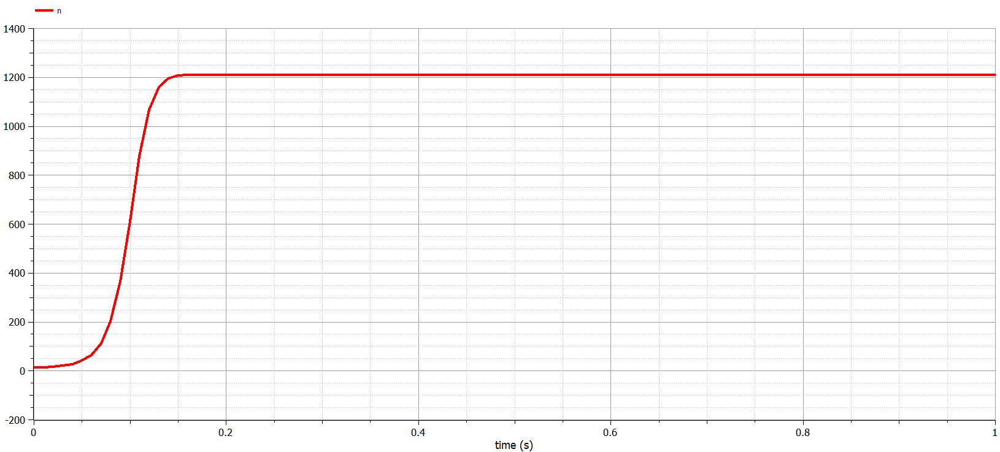{#fig:010 height=60%}

## Ход работы

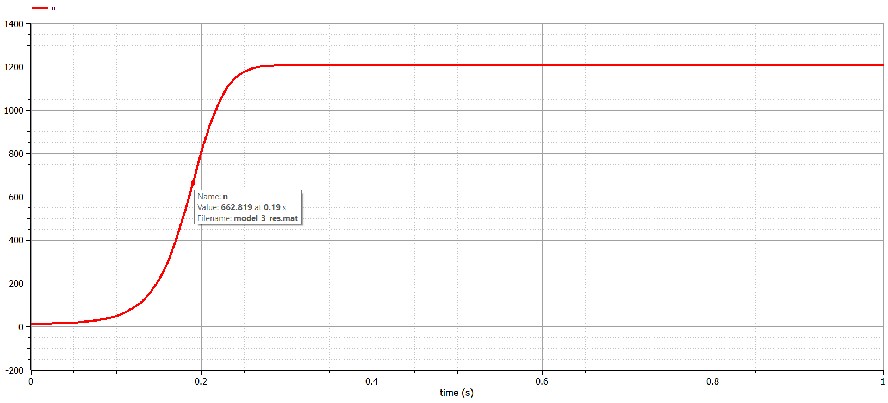{#fig:011 height=60%}

## Результаты
В ходе проделанной работы были построены математические эффективности рекламы и построены графики. Также эти графики были изучены и сделаны выводе о работе программ и эффективности распространения.