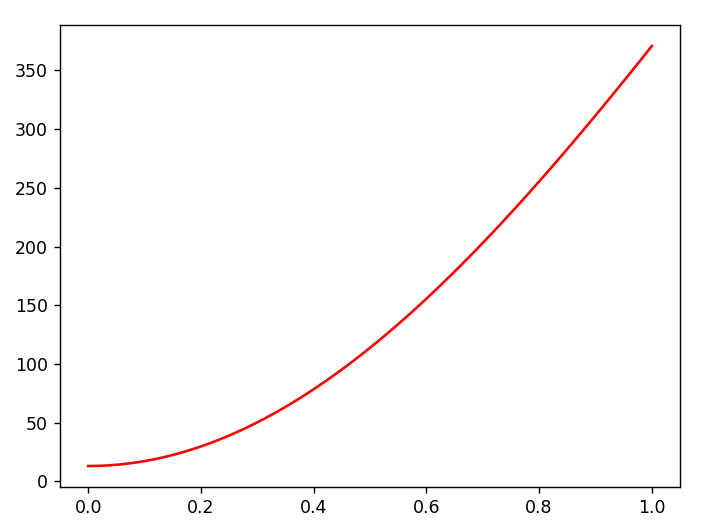

---
## Front matter
title: "Лабораторная работа № 7"
subtitle: "Модель распространения рекламы (Вариант 9)"
author: "Сулицкий Богдан Романович НФИбд-02-20"

## Generic otions
lang: ru-RU
toc-title: "Содержание"

## Bibliography
bibliography: bib/cite.bib
csl: pandoc/csl/gost-r-7-0-5-2008-numeric.csl

## Pdf output format
toc: true # Table of contents
toc-depth: 2
lof: true # List of figures
lot: false
fontsize: 12pt
linestretch: 1.5
papersize: a4
documentclass: scrreprt
## I18n polyglossia
polyglossia-lang:
  name: russian
  options:
    - spelling=modern
    - babelshorthands=true
polyglossia-otherlangs:
  name: english
## I18n babel
babel-lang: russian
babel-otherlangs: english
## Fonts
mainfont: PT Serif
romanfont: PT Serif
sansfont: PT Sans
monofont: PT Mono
mainfontoptions: Ligatures=TeX
romanfontoptions: Ligatures=TeX
sansfontoptions: Ligatures=TeX,Scale=MatchLowercase
monofontoptions: Scale=MatchLowercase,Scale=0.9
## Biblatex
biblatex: true
biblio-style: "gost-numeric"
biblatexoptions:
  - parentracker=true
  - backend=biber
  - hyperref=auto
  - language=auto
  - autolang=other*
  - citestyle=gost-numeric
## Pandoc-crossref LaTeX customization
figureTitle: "Рис."
tableTitle: "Таблица"
listingTitle: "Листинг"
lofTitle: "Список иллюстраций"
lotTitle: "Список таблиц"
lolTitle: "Листинги"
## Misc options
indent: true
header-includes:
  - \usepackage{indentfirst}
  - \usepackage{float} # keep figures where there are in the text
  - \floatplacement{figure}{H} # keep figures where there are in the text
---
# Цель работы

Целью данной работы является построение математической модели эффективности распространения рекламы о салоне красоты. Задать эффективность в трёх случаях.
Построить решение на основе начальных данных. Сделать на основании построений выводы.

# Задание[@lab-task:mathmod]

1.  Изучить модель эфеективности распространения рекламы
2.	Построить графики распространения рекламы в трех заданных случайх
3.	Определить для случая 2 момент времени, в который скорость распространения рекламы будет максимальной
4.	Сделать выводы из трех моделей

## Теоретические введение[@lab-example:mathmod]:

Организуется рекламная кампания нового товара или услуги. Необходимо, чтобы прибыль будущих продаж с избытком покрывала издержки на рекламу. Вначале расходы могут превышать прибыль, поскольку лишь малая часть потенциальных покупателей будет информирована о новинке. Затем, при увеличении числа продаж, возрастает и прибыль, и, наконец, наступит момент, когда рынок насытиться, и рекламировать товар станет бесполезным.

Предположим, что торговыми учреждениями реализуется некоторая продукция, о которой в момент времени $t$ из числа потенциальных покупателей $N$ знает лишь $n$ покупателей. Для ускорения сбыта продукции запускается реклама по радио, телевидению и других средств массовой информации. После запуска рекламной кампании информация о продукции начнет распространяться среди потенциальных покупателей путем общения друг с другом. Таким образом, после запуска рекламных объявлений скорость изменения числа знающих о продукции людей пропорциональна как числу знающих о товаре покупателей, так и числу покупателей о нем не знающих

Модель рекламной кампании описывается следующими величинами.
Считаем, что $\frac{dn}{dt}$ - скорость изменения со временем числа потребителей, узнавших о товаре и готовых его купить,
$t$ - время, прошедшее с начала рекламной кампании,
$N$ - общее число потенциальных платежеспособных покупателей,
$n(t)$ - число  уже информированных клиентов.
Эта величина пропорциональна числу покупателей, еще не знающих о нем, это описывается следующим образом
$\alpha _1(t)(N-n(t))$, где $\alpha _1>0$ -  характеризует интенсивность рекламной кампании (зависит от затрат на рекламу в данный момент времени).
Помимо этого, узнавшие о товаре потребители также распространяют полученную информацию среди потенциальных покупателей, не знающих о нем (в этом случае работает т.н. сарафанное радио). Этот вклад в рекламу описывается величиной  $\alpha _2(t)n(t)(N-n(t))$. эта величина увеличивается с увеличением потребителей узнавших о товаре.

Построить график распространения рекламы, математическая модель которой описывается следующим уравнением:

1.	$\frac{dn}{dt} = (0.7 + 0.00051n(t))(N-n(t))$
2.	$\frac{dn}{dt} = (0.00004 + 0.75n(t))(N-n(t))$
3.	$\frac{dn}{dt} = (0.75sin (0.5t) + 0.35 cos (0.6t))(N-n(t))$

При этом объем аудитории $N = 1210$, в начальный момент о товаре знает 13 человек.

Для случая 2 определить в какой момент времени скорость распространения рекламы будет иметь максимальное значение.

# Выполнение лабораторной работы

## Код на Julia

Подключаем нужные библиотеки и создаем переменные.(@fig:001)

{#fig:001}

С помощью Differential Equations[@diff-eq-doc:julia] создадим функции уравнения и визуализации.(@fig:002)

{#fig:002}

Решаем ОДУ для трёх случаев и создаем математические модели.(@fig:003)

{#fig:003}

Результаты:(@fig:004-@fig:006)

{#fig:004}

{#fig:005}

{#fig:006}

## Код на OpenModelica

Реализуем код на OpenModelica, указав начальные значения переменных. Далее запишем ОДУ, а также укажем интервалы.(@fig:007-@fig:009)

{#fig:007}

{#fig:008}

{#fig:009}

Результаты:(@fig:010-@fig:012)

{#fig:010}

{#fig:011}

{#fig:012}

# Выводы

В ходе выполнения лабораторной работы была изучена модель эффективности рекламы и построены графики. Также эти графики были изучены и сделаны выводе о работе программ и эффективности распространения.

# Список литературы 