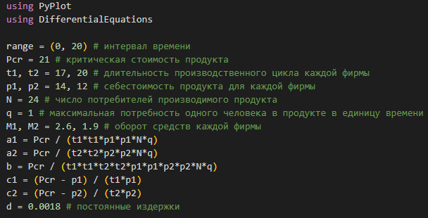
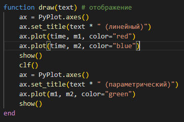
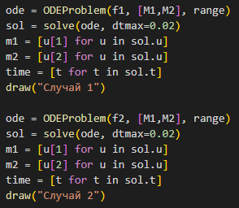
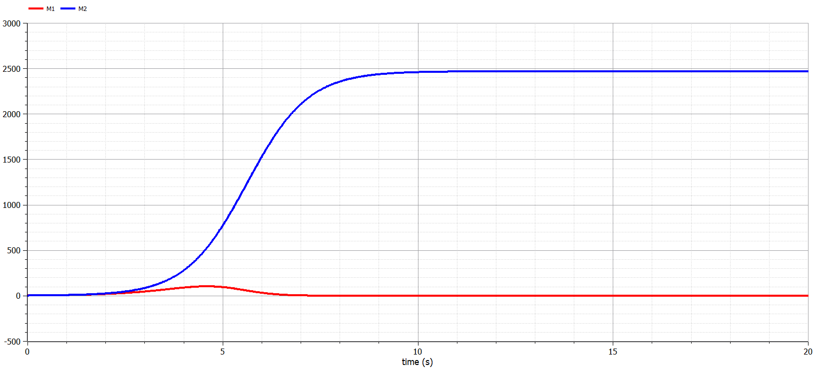

---
## Front matter
title: "Лабораторная работа № 8"
subtitle: "Модель конкуренции двух фирм (Вариант 9)"
author: "Сулицкий Богдан Романович НФИбд-02-20"

## Generic otions
lang: ru-RU
toc-title: "Содержание"

## Bibliography
bibliography: bib/cite.bib
csl: pandoc/csl/gost-r-7-0-5-2008-numeric.csl

## Pdf output format
toc: true # Table of contents
toc-depth: 2
lof: true # List of figures
lot: false
fontsize: 12pt
linestretch: 1.5
papersize: a4
documentclass: scrreprt
## I18n polyglossia
polyglossia-lang:
  name: russian
  options:
    - spelling=modern
    - babelshorthands=true
polyglossia-otherlangs:
  name: english
## I18n babel
babel-lang: russian
babel-otherlangs: english
## Fonts
mainfont: PT Serif
romanfont: PT Serif
sansfont: PT Sans
monofont: PT Mono
mainfontoptions: Ligatures=TeX
romanfontoptions: Ligatures=TeX
sansfontoptions: Ligatures=TeX,Scale=MatchLowercase
monofontoptions: Scale=MatchLowercase,Scale=0.9
## Biblatex
biblatex: true
biblio-style: "gost-numeric"
biblatexoptions:
  - parentracker=true
  - backend=biber
  - hyperref=auto
  - language=auto
  - autolang=other*
  - citestyle=gost-numeric
## Pandoc-crossref LaTeX customization
figureTitle: "Рис."
tableTitle: "Таблица"
listingTitle: "Листинг"
lofTitle: "Список иллюстраций"
lotTitle: "Список таблиц"
lolTitle: "Листинги"
## Misc options
indent: true
header-includes:
  - \usepackage{indentfirst}
  - \usepackage{float} # keep figures where there are in the text
  - \floatplacement{figure}{H} # keep figures where there are in the text
---
# Цель работы

Целью данной работы является построение математической модели конкуренции для двух фирм в двух случаях. Построение графиков с помощью представленных уравнений, описивающих случаи.

# Задание[@lab-task:mathmod]

1.	Изучить модель конкуренции двух фирм
2.	Изучить случаи представленные в варианте
3.	Построить графики изменения оборотных средств в двух случаях

## Теоретические введение[@lab-example:mathmod]:

Для построения модели конкуренции хотя бы двух фирм необходимо рассмотреть модель одной фирмы. Вначале рассмотрим модель фирмы, производящей продукт долговременного пользования, когда цена его определяется балансом спроса и предложения. Примем, что этот продукт занимает определенную нишу рынка и конкуренты в ней отсутствуют. 

Обозначим:

$N$ - число потребителей производимого продукта. 

$S$ – доходы потребителей данного продукта. Считаем, что доходы всех потребителей одинаковы. Это предположение справедливо, если речь идет об одной рыночной нише, т.е. производимый продукт ориентирован на определенный слой населения. 

$M$ – оборотные средства предприятия 

$\tau$ - длительность производственного цикла

$p$ - рыночная цена товара 

$\widetilde{p}$ - себестоимость продукта, то есть переменные издержки на производство единицы продукции

$\delta$ - доля оборотных средств, идущая на покрытие переменных издержек

$k$ - постоянные издержки, которые не зависят от количества выпускаемой продукции

$Q(S/p)$ – функция спроса, зависящая от отношения дохода $S$ к цене $p$. Она равна количеству продукта, потребляемого одним потребителем в единицу времени.

Функцию спроса товаров долговременного использования часто представляют в простейшей форме: 

$$Q = q - k\frac{p}{S} = q(1 - \frac{p}{p_{cr}})$$

где $q$ – максимальная потребность одного человека в продукте в единицу времени.
Эта функция падает с ростом цены и при $p = p_{cr}$ (критическая стоимость продукта) потребители отказываются от приобретения товара. Величина $p_{cr} = Sq/k$. Параметр $k$ – мера эластичности функции спроса по цене. Таким образом, функция спроса является пороговой (то есть, $Q(S/p) = 0$ при $p \geq p_{cr}$) и обладает свойствами насыщения.

Уравнения динамики оборотных средств можно записать в виде:

$$\frac{dM}{dt} = -\frac{M \delta}{\tau} + NQp - k = -\frac{M\delta}{\tau} + Nq(1 - \frac{p}{p_{cr}})p - k$$

Уравнение для рыночной цены $p$ представим в виде:

$$\frac{dp}{dt} = \gamma (-\frac{M\delta}{\tau \widetilde{p}} + Nq(1-\frac{p}{p_{cr}}) )$$

Первый член соответствует количеству поставляемого на рынок товара (то есть, предложению), а второй член – спросу.
Параметр $\gamma$ зависит от скорости оборота товаров на рынке. Как правило, время торгового оборота существенно меньше времени производственного цикла $\tau$. При заданном M уравнение описывает быстрое стремление цены к равновесному значению цены, которое устойчиво.

В этом случае уравнение можно заменить алгебраическим соотношением

$$ -\frac{M\delta}{\tau \widetilde{p}} + Nq(1-\frac{p}{p_{cr}}) = 0$$

равновесное значение цены $p$ равно

$$ p = p_{cr}(1 - \frac{M\delta}{\tau \widetilde{p} Nq})$$

Тогда уравнения динамики оборотных средств приобретает вид

$$\frac{dM}{dt} = -\frac{M \delta}{\tau}(\frac{p}{p_{cr}}-1) - M^2 ( \frac{\delta}{\tau \widetilde{p} })^2 \frac{p_{cr}}{Nq} - k$$

Это уравнение имеет два стационарных решения, соответствующих условию $dM/dt=0$

$$ \widetilde{M_{1,2}} = \frac{1}{2} a \pm \sqrt{\frac{a^2}{4} - b}$$

где

$$ a = Nq(1 - \frac{\widetilde{p}}{p_{cr}} \widetilde{p} \frac{\tau}{\delta}), b = kNq \frac{(\tau \widetilde{p})^2}{p_{cr}\delta ^2} $$

Получается, что при больших постоянных издержках (в случае $a^2 < 4b$) стационарных состояний нет. Это означает, что в этих условиях фирма не может функционировать стабильно, то есть, терпит банкротство. Однако, как правило, постоянные затраты малы по сравнению с переменными (то есть, $b << a^2$) и играют роль, только в случае, когда оборотные средства малы. 

При $b << a$ стационарные значения $M$ равны

$$ \widetilde{M_{+}} = Nq \frac{\tau}{\delta}(1 - \frac{\widetilde{p}}{p_{cr}})\widetilde{p}, \widetilde{M_{-}} = k\widetilde{p} \frac{\tau}{\delta(p_{cr} - \widetilde{p})} $$

Первое состояние $\widetilde{M_{+}}$ устойчиво и соответствует стабильному функционированию предприятия. Второе состояние $\widetilde{M_{-}}$ неустойчиво, так, что при $M < \widetilde{M_{-}}$ оборотные средства падают ($dM/dt < 0$), то есть, фирма идет к банкротству. По смыслу $\widetilde{M_{-}}$ соответствует начальному капиталу, необходимому для входа в рынок.

В обсуждаемой модели параметр $\delta$ всюду входит в сочетании с $\tau$. Это значит, что уменьшение доли оборотных средств, вкладываемых в производство, эквивалентно удлинению производственного цикла. Поэтому мы в дальнейшем положим: $\delta = 1$, а параметр $\tau$ будем считать временем цикла, с учётом сказанного.

### Вариант 9

Случай 1

Рассмотрим две фирмы, производящие взаимозаменяемые товары одинакового качества и находящиеся в одной рыночной нише. Считаем, что в рамках нашей модели конкурентная борьба ведётся только рыночными методами. То есть, конкуренты могут влиять на противника путем изменения параметров своего производства: себестоимость, время цикла, но не могут прямо вмешиваться в ситуацию на рынке («назначать» цену или влиять на потребителей каким-либо иным способом.) Будем считать, что постоянные издержки пренебрежимо малы, и в модели учитывать не будем. В этом случае динамика изменения объемов продаж фирмы 1 и фирмы 2 описывается следующей системой уравнений:

$$\frac{dM_1}{d\Theta} = M_1 - \frac{b}{c_1}M_1 M_2 - \frac{a1}{c1} M_1^2 $$

$$ \frac{dM_2}{d\Theta} = \frac{c_2}{c_1} M_2 - \frac{b}{c_1} M_1 M_2 - \frac{a_2}{c_1} M_2^2$$
где 

$$ a_1 = \frac{p_{cr}}{\tau_1^2 \widetilde{p}_1^2 Nq } $$
$$ a_2 = \frac{p_{cr}}{\tau_2^2 \widetilde{p}_2^2 Nq } $$ 
$$ b = \frac{p_{cr}}{\tau_1^2 \widetilde{p}_1^2 \tau_2^2 \widetilde{p}_2^2 Nq} $$
$$ c_1 = \frac{p_{cr} - \widetilde{p}_1}{\tau_1 \widetilde{p}_1} $$
$$ c_2 = \frac{p_{cr} - \widetilde{p}_2}{\tau_2 \widetilde{p}_2} $$

также введена нормировка $t = c_1 \Theta$

Случай 2

 Рассмотрим модель, когда, помимо экономического фактора влияния (изменение себестоимости, производственного цикла, использование кредита и т.п.), используются еще и социально-психологические факторы – формирование общественного предпочтения одного товара другому, не зависимо от их качества и цены. В этом случае взаимодействие двух фирм будет зависеть друг от друга, соответственно коэффициент перед $M_1 M_2$ будет отличаться. Пусть в рамках рассматриваемой модели динамика изменения объемов продаж фирмы 1 и фирмы 2 описывается следующей системой уравнений:

$$\frac{dM_1}{d\Theta} = M_1 - (\frac{b}{c_1} + 0.0018)M_1 M_2 - \frac{a1}{c1} M_1^2 $$

$$ \frac{dM_2}{d\Theta} = \frac{c_2}{c_1} M_2 - \frac{b}{c_1} M_1 M_2 - \frac{a_2}{c_1} M_2^2$$

## Для обоих случаев рассмотрим задачу со следующими начальными условиями и параметрами

$$ M_0^1=2.6 \: M_0^2=1.9 $$
$$ p_{cr}=21 \: N=24 \: q=1 $$
$$ \tau_1=17 \: \tau_2=20 $$
$$ \widetilde{p}_1=14 \: \widetilde{p}_2=12 $$

# Выполнение лабораторной работы

Подключаем нужные библиотеки и создаем переменные.(@fig:001)

{#fig:001}

С помощью Differential Equations[@diff-eq-doc:julia] создадим функции уравнения и визуализации.(@fig:002-@fig:003)

{#fig:002}

{#fig:003}

Решаем ОДУ для обоих случаев и создаем математические модели.(@fig:004)

{#fig:004}

Результаты:(@fig:005-@fig:008)

{#fig:005}

.png){#fig:006}

{#fig:007}

.png){#fig:008}

## Код на OpenModelica

Реализуем код на OpenModelica, указав начальные значения переменных. Далее запишем ОДУ, а также укажем интервалы.(@fig:009-@fig:010)

{#fig:009}

{#fig:010}

Результаты:(@fig:011-@fig:014)

{#fig:011}

.png){#fig:012}

{#fig:013}

.png){#fig:014}

# Выводы

В ходе выполнения лабораторной работы была изучена модель конкуренции и построены графики для двух фирм в двух случаях.

# Список литературы 